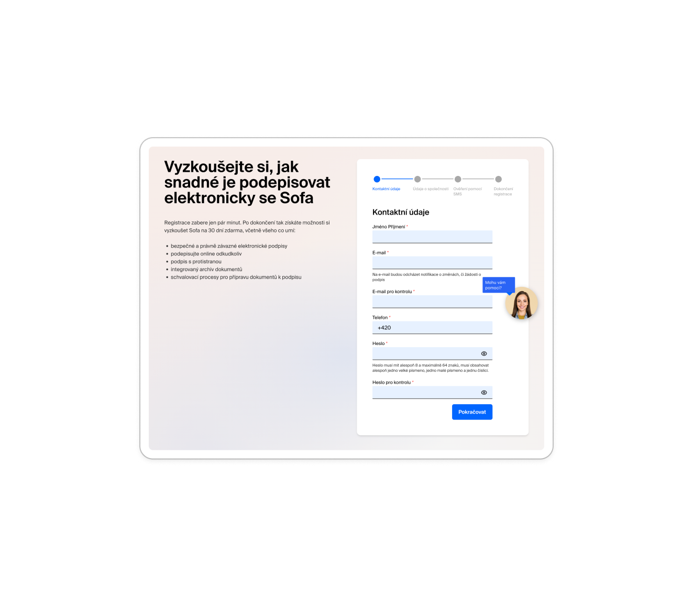
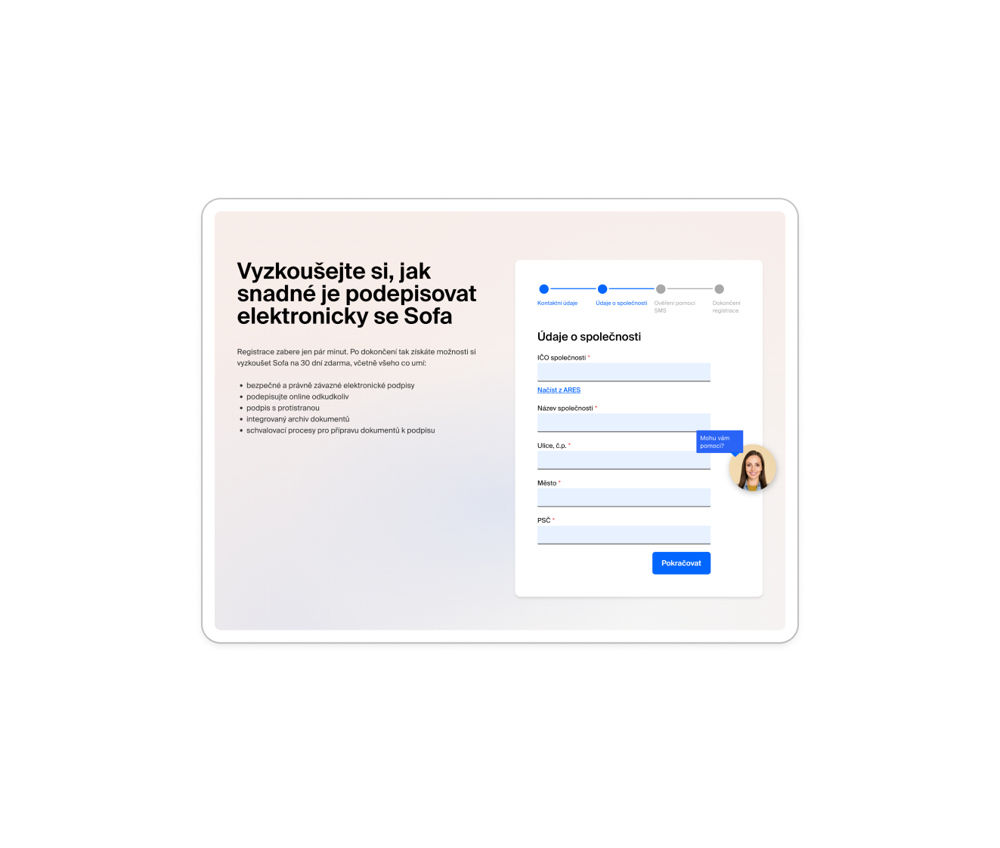
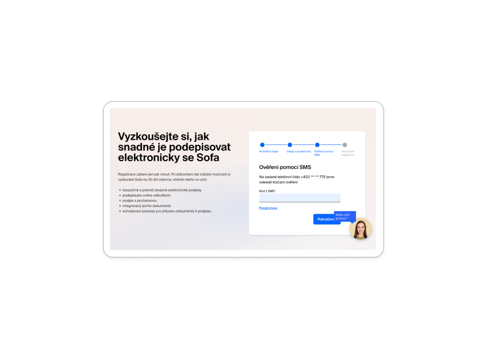

# Case Study: Sofa SignPoint – Redesign registrace

## TL;DR
Jak vzít 8krokový registrační proces a udělat z něj 2 kroky - a přitom zlepšit bezpečnostní validaci? To byl úkol od Software602 pro jejich e-signature platformu Sofa SignPoint.

**Výsledek:** 78% redukce kroků, 55% redukce polí, eliminace všech duplicitních vstupů, time to first value < 2 minuty.

---

## Problém

Uživatelé opouštěli registraci ještě před jejím dokončením. Důvod? Zastaralý vícestránkový formulář vyžadující duplicitní vstupy, následovaný aktivací emailem, následovanou ručním přihlášením.

**Než mohli uživatelé podepsat první dokument, museli provést 8-9 samostatných akcí.**

### Původní flow (8-9 kroků)

#### Krok 1: Kontaktní údaje
- Jméno a příjmení
- Email (dvakrát "pro ověření")
- Potvrzení emailu
- Telefonní číslo
- Heslo (dvakrát "pro ověření")
- Potvrzení hesla

#### Krok 2: Údaje o společnosti
- IČO s ARES integrací
- Název společnosti
- Ulice
- Město
- PSČ

#### Krok 3: SMS ověření
- Zadání 6místného kódu
- Čekání na countdown timer pro resend

#### Krok 4: Aktivace emailem
- Kontrola emailové schránky
- Kliknutí na aktivační link
- Kliknutí na tlačítko "Aktivovat účet" (+2 další kliky)

#### Krok 5: Přihlášení
- Opětovné zadání emailu
- Opětovné zadání hesla
- Konečně přístup k dashboardu

**Progress indikátor:** 4kroková lišta (Kontaktní údaje → Údaje o společnosti → Ověření pomocí SMS → Dokončení registrace)

---

## Proces: Co jsem dělal

### 1. Identifikace friction points
Prošel jsem každý krok a ptal se: "Je tohle nutné?"

**Červené vlajky:**
- Duplicitní pole pro email a heslo (pattern z éry před show/hide tlačítky)
- Separátní aktivace emailem PLUS SMS verifikace (proč obojí?)
- Nutnost přihlášení po dokončení registrace (user právě zadal své credentials!)
- Separátní celá stránka pro firemní údaje (proč?)

### 2. Analýza user flow
**Klíčové zjištění:** Mezi "chci podepsat dokument" a "můžu podepsat dokument" je 8-9 kroků, z nichž většina je zbytečná nebo duplicitní.

### 3. Challenge assumptions
- **"Email musí být dvakrát pro ověření"** → Ne, proto existuje show/hide toggle
- **"Potřebujeme email aktivaci"** → Ne, pokud máme SMS verifikaci
- **"User se musí přihlásit po registraci"** → Ne, už prokázal identitu
- **"Firemní údaje potřebují vlastní stránku"** → Ne, ARES to vyplní automaticky

---

## Řešení: Nový 2krokový flow

### Krok 1: Všechna potřebná data (jedna stránka)
- Jméno a příjmení
- Email (jednou)
- Heslo (jednou, s show/hide togglem)
- Telefonní číslo
- IČO (volitelné, s ARES auto-fill)

### Krok 2: SMS ověření
- Zadání 6místného kódu
- Auto-advance mezi input fieldy
- Countdown timer pro resend
- **Automatické přihlášení po verifikaci**

**Výsledek:** Okamžitý přístup k dashboardu, připravený podepsat první dokument.

**Progress indikátor:** 2kroková lišta (Základní údaje → Potvrzení SMS)

---

## Klíčová UX zlepšení

### 1. Eliminace duplicitních polí
**Problém:** Email a heslo vyžadováno dvakrát "pro ověření"
**Řešení:** Single input s show/hide password togglem
**Reasoning:** Moderní UX pattern - duplikování polí je zastaralá praxe z doby před existencí show/hide tlačítek. Vytváří zbytečné tření a kognitivní zátěž.

### 2. Redukce kroků z 8-9 na 2
**Problém:** Multi-step registrace + separátní aktivace + separátní přihlášení
**Řešení:** Spojená registrace + automatické přihlášení
**Reasoning:** Každý extra krok zabíjí konverzi. Uživatelé, kteří právě poskytli credentials, by je neměli zadávat znovu okamžitě.

### 3. Odstranění email aktivačního kroku
**Problém:** Post-registrační email s aktivačním linkem vyžadoval další kliky
**Řešení:** Pouze SMS verifikace (pokud vyžadována compliance)
**Reasoning:** Email aktivace přidává 2-3 extra kroky bez bezpečnostního přínosu, pokud existuje SMS verifikace. Pokud to nevyžaduje compliance, je to čisté tření.

### 4. Automatické přihlášení
**Problém:** Po dokončení 4 registračních kroků + aktivace musel user ručně přihlásit
**Řešení:** Okamžitý přístup k dashboardu po SMS verifikaci
**Reasoning:** User už prokázal identitu. Nutit ho znovu se přihlásit je nepřátelské UX.

### 5. Progressive disclosure pro firemní data
**Problém:** Separátní celá obrazovka pro firemní informace
**Řešení:** Volitelné IČO pole s ARES integrací, která auto-vyplní firemní data
**Reasoning:** Ne všichni uživatelé jsou firmy. Pro ty, kteří jsou, ARES lookup eliminuje ruční zadávání. Volitelné pole snižuje vnímanou komplexitu.

---

## Výsledky: Měřitelný impact

| Metrika | Před | Po | Zlepšení |
|---------|------|-------|----------|
| **Kroky k dashboardu** | 8-9 kroků | 2 kroky | **78% redukce** |
| **Povinná pole** | 11+ polí | 5 polí | **55% redukce** |
| **Duplicitní vstupy** | 4 (email x2, heslo x2) | 0 | **100% eliminace** |
| **Separátní stránky** | 5 stránek | 2 stránky | **60% redukce** |
| **Re-autentizace** | Vyžadována | Automatická | **Eliminováno** |
| **Time to first value** | 5-10 minut | <2 minuty | **~75% rychlejší** |

---

## UX principy, které jsem aplikoval

### 1. Reduction over Addition
"Nejlepší UX je žádné UX" - Každé odstraněné pole, každý eliminovaný krok zlepšuje zážitek. Šel jsem z 11+ povinných polí na 4 obrazovkách na 5 polí na 2 obrazovkách.

### 2. Moderní UI patterns
- Show/hide password toggle místo duplikovaných password polí
- Auto-advancing SMS code inputs s individuálními character boxy
- Smart defaults a volitelná pole

### 3. Respekt k user contextu
User právě registroval s emailem + heslem. Nutit ho přihlásit se znovu se stejnými credentials je absurdní. Automatické přihlášení ukazuje respekt k času a kontextu uživatele.

### 4. Progressive Disclosure
Firemní data (IČO) jsou volitelná. Pokud zadána, ARES integrace auto-vyplní zbytek. Power users dostanou power features, simple users dostanou simple flow.

### 5. Immediate Value
Dashboard přístupný okamžitě po verifikaci. První dokument může být podepsán během sekund od dokončení registrace. Žádné nastavování není potřeba.

### 6. Contextual Help over Onboarding
Místo tutorial/onboarding obrazovek vede dashboard samotný uživatele:
- "Dashboard Zero" stav ukazuje jasné call-to-action: "Nahrajte první dokument"
- Empty states nejsou jen prázdné - jsou to pozvánky k akci
- Help se objevuje když je potřeba, ne předem

---

## Bonus: Rozhodnutí neimplementovat onboarding

**Úkol 2 byl záměrně NESPLNĚN.**

**Filozofie:** "Pokud uživatelé potřebují onboarding aby pochopili vaši appku, problém není chybějící onboarding - problém je vaše appka."

Pro Sofa SignPoint s JEDNÍM jasným use case (podepsat a odeslat dokumenty) bylo řešení:
- Self-evident design
- Jasné empty states s calls to action
- Contextual help když potřeba
- Learn by doing, ne watching tutoriály

**Výsledek:** Žádný pre-use tutorial ani walkthrough. Uživatelé objevují features přirozeně jak je potřebují.

---

## Co jsem se naučil

### 1. Každé pole je příležitost k opuštění
Uživatelé nemají neomezenou pozornost. Každý požadavek na input je transakcí - a ty transakce se sčítají. Redukce z 11+ polí na 5 nebyla jen "nice to have" - byla to fundamentální změna user experience.

### 2. Legacy patterns umírají těžce
"Tak jsme to vždycky dělali" není argument. Duplicitní pole pro email/heslo pocházejí z doby před show/hide tlačítky. Email aktivace + SMS verifikace je double validation bez důvodu. Výzva je mít odvahu tyto assumptions challengovat.

### 3. Kontext je král
User journey nezačíná "přihlášením" - začíná "chci podepsat dokument". A nekončí "registrací" - končí "podepsal jsem dokument". Všechno mezi těmito body je tření. Měřítko úspěchu není "kolik features jsme přidali" ale "kolik friction jsme odstranili".

### 4. Čísla nevylžou
78% redukce kroků není jen kosmetická změna. Je to rozdíl mezi "možná to dokončím později" a "hotovo, můžu pokračovat". Měřitelné metriky jsou klíč k obhajobě bold rozhodnutí.

---

## Technické detaily

### Design System
- **Barvy:** Off-white (#fafafa), soft black (#1a1a1a), blue (#007bff)
- **Bez borders:** White space pro separaci, ne čáry
- **Minimalistický:** Čistý, vzdušný layout

### Micro-interactions
- Step indikátory: 20px kroužky, active = černé pozadí, inactive = šedé
- Password toggle: "Zobrazit/Skrýt" tlačítko integrované v inputu
- SMS inputs: 6 individuálních boxů s auto-advance on input
- Resend timer: 60sekundový countdown před povolením resend

### Friendly Error Messages
Příklad: "Zkontrolujte prosím @ a koncovku (např. jmeno@domena.cz)"
- Vždy zdvořilé ("prosím", "zkontrolujte")
- Specifické a užitečné s příklady
- Solution-focused, ne blame-focused

---

## Závěr

Tento registrační redesign ukazuje user-centered myšlení, moderní UX patterns, a odvahu challengovat legacy assumptions.

**Klíčové zjištění:** Nejlepší feature je feature, který nemusíte vysvětlovat. A nejlepší UX je cesta, kterou si uživatel ani nevšimne - prostě to fungovalo.

---

**Live demo:** [Nový registrační flow](registrace-1.html)
**Původní design:** Viz screenshots v `pics/` složce
**Celá prezentace:** [UX redesign prezentace](../sofa-signpoint-ux/prezentace.html)
