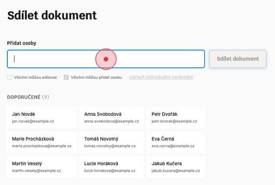

# Share Form Walkthrough

This animated GIF demonstrates the document sharing interface with Fluent UI components.

## Step-by-Step Guide

### 1. Initial State (0:00)
- Clean interface with input field and button
- Search field with label "Přidat osoby"
- Checkboxes disabled until people are selected
- Share button disabled
- Grid of 10 recommended people displayed

### 2. Type to Search (0:02)
- User types "Anna" in the search field
- Input field highlights with blue focus state
- Cards below filter to show matching results

### 3. Autocomplete Dropdown (0:04)
- Dropdown appears below input field
- Shows matching people with names and emails
- Clean white dropdown with hover states

### 4. Select from Dropdown (0:06)
- User clicks "Anna Svobodová" from dropdown
- Person is added to selection
- Pill appears showing selected person
- Checkboxes become enabled
- Share button becomes enabled
- Selected card gets blue highlight

### 5. Add Second Person (0:08)
- User clicks "Petr Dvořák" card directly
- Second pill appears
- Both people now selected
- Card also shows blue selected state

### 6. Set Permissions (0:10)
- User checks "Všichni můžou editovat" checkbox
- Global permission applies to all selected people
- Second checkbox ("Všichni můžou přidat osobu") already checked by default

### 7. Individual Permissions (0:12)
- User clicks "Upravit individuální oprávnění" link
- Modal opens showing both selected people
- Each person has individual permission checkboxes
- Compact layout with person info on left, permissions on right
- Clean modal with header and close button

## Key Features Demonstrated

✅ **Search & Autocomplete** - Type-ahead search with dropdown suggestions
✅ **Dual Selection Methods** - Select from dropdown or click cards directly
✅ **Visual Feedback** - Pills for selected people, blue highlights on cards
✅ **Smart Defaults** - "Add person" permission checked by default
✅ **Global Permissions** - Apply permissions to all at once
✅ **Individual Control** - Fine-tune permissions per person via modal
✅ **Responsive Layout** - CSS Grid ensures perfect alignment
✅ **Clear Hierarchy** - Checkboxes tight to input, proper spacing to cards

## Design Details

- **Typography**: Inter for body text, Krub for headers
- **Colors**: Fluent UI blue (#0078d4) with proper disabled states
- **Layout**: CSS Grid (1fr + 160px columns) for guaranteed alignment
- **Spacing**: Input → checkboxes (4px), checkboxes → pills (12px), pills → cards (20px)
- **Accessibility**: Proper labels, disabled states, keyboard navigation

## Technical Implementation

- Fluent UI Web Components via CDN
- Custom input field for better styling control
- CSS Grid for column alignment
- CSS variables for theming
- Modal overlay pattern for individual permissions
- Responsive design with mobile breakpoints
